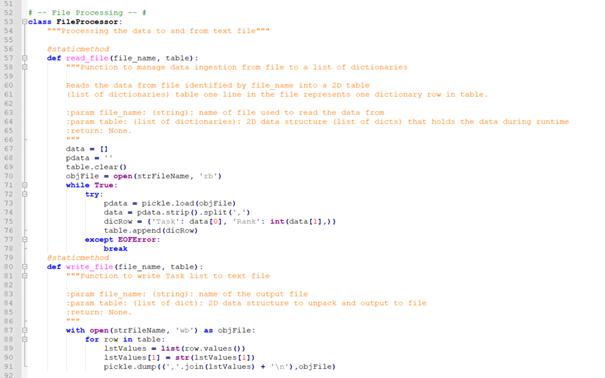
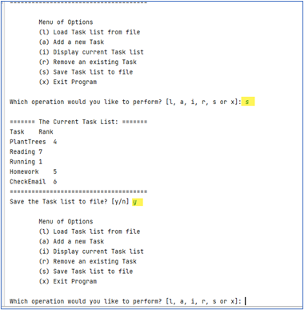

# FDN Programming 110 Assignment 07

Jason Johanneck  
2022-May-31  
IT FDN Programming 110  
Module07 Assignment07  

## Introduction
In Assignment07 we were asked to apply our knowledge of pickling data and basic error exception handling. For this assignment, I used assignment06 as a template and continued to use menu processing logic to manage a Task List.  I changed the selections from a numeric choice to an alpha character and included an option to display the current Task list.

Here is an example of my menu options:  

Menu of Options  

(l) Load Task list from file  
(a) Add a new Task  
(i) Display current Task list  
(r) Remove an existing Task  
(s) Save Task list to file  
(x) Exit Program  

## Building the script.  
Code Listing Lines 1 – 92 (Data Processing and File Processing)  

Code Listing Lines 93 – 156 (Data Processing and File Processing)  

Code Listing for Lines 157 -2227  (contains code for main section):

## The Python code was broken out into four sections:

### Section one: A function class for Data Processing was defined that included two functions:  

### Section two: File Processing with two functions for reading and writing data.

Both the read_file and write_file functions used pickling.  

### Section three: I/O Processing:

This section includes functions to print the menu, retrieve a user choice, display the current task list and to prompt the user for a task to remove.  

### Section Four: Main Script  

#### Main script code segment to check for TaskList.txt file size and existence.  

This section starts with checking for the existence of the file, and will display a message if the file does not exist.
Or if the file exists but is empty, that is noted as well.  Exception handling is used to check for file size and file existence.

####  Main Script primary code block to handle menu choices:  

This section handles all of the menu options.  I have highlighted code that uses exception handling to verify the Task Priority/Rank is input as an integer.

## Running the script.
### From the PyCharm application:

Here is the Initial Display after pressing the run button

Note – the initial contents of the TaskList.txt file is displayed.  

Here is output after selecting the option to add a new Task:  

Here is the output after selecting the menu choice to display the current task list:  

 

Here is the output after choosing to remove a Task: 

(Note – the Task list is automatically re-displayed after removing an item)    

This is the output after selecting the menu option to save the Task list to disk:  

 

Here I am showing the contents of TaskList.txt after saving to disk:  

 
Finally, here is PyCharm output after choosing to Exit:  

 

## Summary

In this assignment we learned how to read and write binary data to a file as well as how to do perform basic exception handling.  We also covered additional tools for formatting GitHub web pages.
